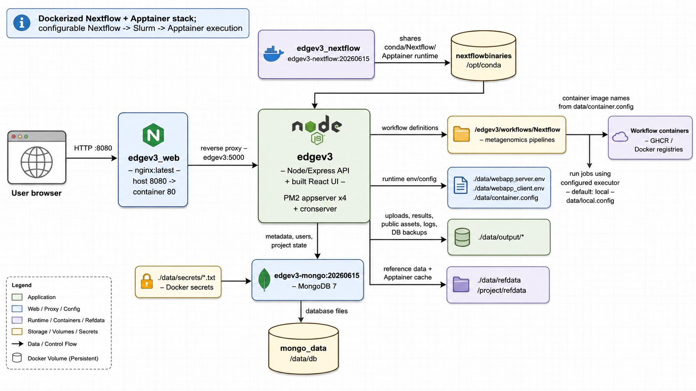

# EDGEv3 Docker Application Bundle

This directory packages LANL EDGEv3 as a local Docker Compose deployment. EDGEv3 is a web-based bioinformatics platform for uploading sequencing inputs, submitting metagenomics workflows, monitoring jobs, and browsing workflow results.

The bundle includes the Docker Compose stack, helper scripts, image build/load assets, runtime configuration, mounted data directories, and the EDGEv3 source tree used to build the application image.

## Quick Start

### Prerequisites

- Docker Engine or Docker Desktop with Compose support.
- Enough local disk space for project outputs, reference data, workflow caches, and container images.
- Host ports `8080` and `5000` available. The helper script also checks `27017` during some commands.
- Linux `amd64` container support. The compose file sets `platform: linux/amd64` for all services. Apple Mac OS is not supported.

### Start the Stack

```bash
./edgev3_app.sh init
./edgev3_app.sh status
./edgev3_app.sh open
```

Then open:

```text
http://localhost:8080
```

`init` imports required images when needed, resets Docker named volumes, and starts the stack. After the first initialization, use `check`, `start`, and `stop` for normal lifecycle management.

On the first `init`, `start`, or `restart`, the helper generates MongoDB passwords, an initial web-administrator password, a random account code, and a JWT secret. It also creates `data/webapp_server.env` from its checked-in example and inserts the MongoDB app user's credentials into `DATABASE_HOST`. Existing secrets are reused on later starts.

The initial web login is `admin@my.edge`. Its generated password is stored locally at `data/secrets/edgev3_admin_password.txt` with owner-only permissions. Change the password through the web UI after the first login.

```bash
./edgev3_app.sh check
./edgev3_app.sh start
./edgev3_app.sh status
./edgev3_app.sh stop
```

If `import` reports a missing `docker_images/nginx_latest_amd64.tgz`, create or provide that archive before re-running the command. `docker_build.sh` can build/save the expected image archives when Docker build tooling and `pigz` are available.

## Helper Commands

`edgev3_app.sh` is the main local operations entry point.

| Command | Purpose |
| --- | --- |
| `check` | Verify Docker, Compose, and expected local image tags. |
| `import` | Load image archives from `docker_images/`. |
| `init` | Run checks, import images, reset named volumes, and start the stack. |
| `start` | Start the existing stack without resetting volumes. |
| `stop` | Stop the stack. |
| `restart` | Stop and start the stack. |
| `status` | Show Compose service status. |
| `open` | Open `http://localhost:8080` in the local browser. |

Logs from the helper script are appended to `logs/edgev3.log`. Application logs are written under `data/output/log/`.

## Architecture And Data Flow



### Compose Services

| Service | Image | Role |
| --- | --- | --- |
| `edgev3_web` | `nginx:latest` | Public entry point on `localhost:8080`; proxies requests to `edgev3:5000` and serves a splash page while the app is unavailable. |
| `edgev3` | `edgev3:20260713` | Main EDGEv3 web application. Builds the React client on startup, runs the Express API and cron monitor under PM2, executes workflows, and reads/writes mounted data. |
| `edgev3_admin_init` | `edgev3:20260713` | One-shot initializer that bcrypt-hashes the generated web-admin password at runtime and creates or rotates the initial administrator before the app starts. |
| `edgev3_nextflow` | `edgev3-nextflow:20260615` | Provides the shared `/opt/conda` runtime volume containing Nextflow and Apptainer tooling. |
| `mongodb` | `edgev3-mongo:20260721` | MongoDB database initialized with local secret files and persisted in the `mongo_data` Docker volume. |

## Important Paths

| Path | Purpose |
| --- | --- |
| `docker-compose.yaml` | Defines the local service topology, ports, volumes, secrets, and startup commands. |
| `edgev3_app.sh` | Main lifecycle helper for checks, image imports, and Compose commands. |
| `docker_build.sh` | Builds and saves the expected Docker image archives. |
| `docker_images/` | Dockerfiles and `.tgz` image archives used by the import flow. |
| `src/edge-v3/` | EDGEv3 application source copied into the app image. |
| `src/edgev3-mongo/` | MongoDB initialization assets used by the Mongo image. |
| `src/edgev3-mongo/installation/init-edgev3-admin.js` | Runtime web-administrator initializer; contains no password or password hash. |
| `data/web_nginx.conf` | Nginx reverse proxy configuration. |
| `data/webapp_server.env.example` | Checked-in, non-secret template for the generated server environment. |
| `data/webapp_server.env` | Generated, Git-ignored server settings containing the database connection, JWT, and optional provider keys. |
| `data/webapp_client.env` | Client-side feature flags and Vite settings. |
| `data/container.config` | Nextflow/Apptainer container mapping for individual workflow stages. |
| `data/local.config` | Nextflow local process configuration. |
| `data/secrets/` | Generated, Git-ignored MongoDB usernames/passwords mounted as Docker secrets. |
| `data/output/` | Persistent bind-mounted workspace for projects, uploads, public files, logs, SRA data, bulk submissions, and database backups. |
| `data/refdata/` | Reference data and Nextflow/Apptainer cache mount. |

## Configuration Notes

- `data/secrets/` is generated with owner-only directory permissions (`0700`). Its files are owner-writable and container-readable (`0644`) because local Docker Compose exposes file-backed secrets as bind mounts whose host ownership is preserved on Linux. `data/webapp_server.env` remains owner-only, and none of these files are tracked by Git. Back them up securely if the persisted `mongo_data` volume must be retained.
- To rotate MongoDB credentials, remove all six `data/secrets/mongo_*.txt` files and run `./edgev3_app.sh init`. The `init` command resets the MongoDB volume so it can be initialized with the new credentials. Do not delete only part of the secret set.
- The web-administrator password is generated separately in `edgev3_admin_password.txt`; no web password or bcrypt hash is included in the Mongo image. The accompanying `edgev3_admin_code.txt` is also random rather than a fixed `000000` value.
- To rotate only the bootstrap web-administrator credential, remove both `data/secrets/edgev3_admin_*.txt` files and start the stack. The one-shot initializer updates `admin@my.edge` without resetting the MongoDB volume.
- Once an administrator changes their password in the UI, ordinary restarts preserve that password. The initializer reapplies credentials only when the two bootstrap secret files change.
- Add provider API keys only to the generated `data/webapp_server.env`; never add them to `data/webapp_server.env.example`.
- Do not copy server-side provider keys into `data/webapp_client.env`; browser-visible configuration should only contain public feature flags and URLs.
- `NEXTFLOW_EXECUTOR` defaults to `local` in `data/webapp_server.env`. Use the server environment file and the appropriate Nextflow config files if switching to another executor such as Slurm.
- Workflow container image selections live in `data/container.config`, which is mounted over the in-image Nextflow metagenomics container config.
- Workflow local process configuration live in `data/local.config`, which is mounted over the in-image Nextflow metagenomics config.

## Data Persistence

The stack uses both Docker named volumes and host bind mounts:

- `mongo_data` persists MongoDB data at `/data/db`.
- `nextflowbinaries` shares the Nextflow/Apptainer conda environment at `/opt/conda`.
- `data/output/*` stores user-facing application state, uploaded inputs, results, logs, public files, and database backups on the host.
- `data/refdata` stores reference data and workflow container cache content on the host.

Be careful with:

```bash
./edgev3_app.sh init
```

It runs Compose with volume reset behavior for named Docker volumes. Also review `cleanup.sh` before using it; it deletes project and log contents under `data/output/` and `logs/`.

## Development And Rebuilds

To rebuild the local image archives:

```bash
./docker_build.sh
```

The script builds:

- `edgev3:20260713`
- `edgev3-nextflow:20260615`
- `edgev3-mongo:20260721`
- `nginx:latest`

The generated archives are written to `docker_images/` with the current architecture suffix.

## Troubleshooting

- If the web UI shows the splash page, the Nginx container is running but `edgev3` is not ready or not reachable yet. Check `./edgev3_app.sh status` and `data/output/log/`.
- If startup fails on ports, stop the process using the reported port or edit the host-side port mappings in `docker-compose.yaml`.
- If MongoDB remains unhealthy, verify that all six `mongo_*.txt` files under `data/secrets/` exist. The helper deliberately stops when only part of the set is present.
- If `edgev3_admin_init` fails, verify that both `edgev3_admin_password.txt` and `edgev3_admin_code.txt` exist, then inspect its logs with `docker compose logs edgev3_admin_init`.
- If workflow jobs fail to pull or run containers, check `data/container.config`, `data/local.config`, `data/refdata/nextflow/.apptainer`, Docker/Apptainer availability, and network access to the configured registries.

## License

See `src/edge-v3/LICENSE` for the bundled EDGEv3 license.
