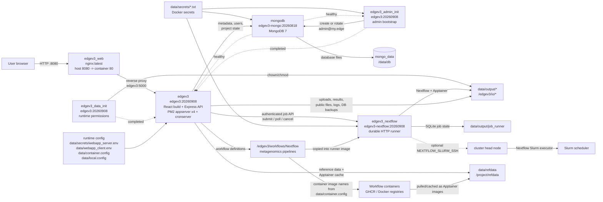

# EDGEv3 Docker Application Bundle

This directory packages LANL EDGEv3 as a local Docker Compose deployment. EDGEv3 is a web-based bioinformatics platform for uploading sequencing inputs, submitting metagenomics workflows, monitoring jobs, and browsing workflow results.

The bundle includes the Docker Compose stack, helper scripts, image build/load assets, runtime configuration, mounted data directories, and the EDGEv3 source tree used to build the application image.

## Quick Start

### Prerequisites

- Docker Engine or Docker Desktop with Compose support.
- Enough local disk space for project outputs, reference data, workflow caches, and container images.
- Host ports `8080` and `5000` available. The helper script also checks `27017` during some commands.
- Linux `amd64` container support. The compose file sets `platform: linux/amd64` for all services. Apple Mac OS is not supported.

### Start the Stack

```bash
./edgev3_app.sh init
./edgev3_app.sh status
./edgev3_app.sh open
```

Then open:

```text
http://localhost:8080
```

`init` imports required images when needed, resets Docker named volumes, and starts the stack. After the first initialization, use `check`, `start`, and `stop` for normal lifecycle management.

On the first `init`, `start`, or `restart`, the helper generates MongoDB passwords, an initial web-administrator password, a random account code, and a JWT secret. It also creates `data/secrets/webapp_server.env` from its checked-in example and inserts the MongoDB app user's credentials into `DATABASE_USERNAME`/`DATABASE_PASSWORD`. Existing secrets are reused on later starts.

The initial web login is `admin@my.edge`. Its generated password is stored locally at `data/secrets/edgev3_admin_password.txt` inside the owner-only secrets directory. Change the password through the web UI after the first login.

```bash
./edgev3_app.sh check
./edgev3_app.sh start
./edgev3_app.sh status
./edgev3_app.sh stop
```

If `import` reports a missing `docker_images/nginx_latest_amd64.tgz`, create or provide that archive before re-running the command. `docker_build.sh` can build/save the expected image archives when Docker build tooling and `pigz` are available.

## Helper Commands

`edgev3_app.sh` is the main local operations entry point.

| Command | Purpose |
| --- | --- |
| `check` | Verify Docker, Compose, and expected local image tags. |
| `import` | Load image archives from `docker_images/`. |
| `init` | Run checks, import images, reset named volumes, and start the stack. |
| `start` | Start the existing stack without resetting volumes. |
| `stop` | Stop the stack. |
| `restart` | Stop and start the stack. |
| `status` | Show Compose service status. |
| `open` | Open `http://localhost:8080` in the local browser. |

Logs from the helper script are appended to `logs/edgev3.log`. Application logs are written under `data/output/log/`.

## Architecture And Data Flow



### Compose Services

| Service | Image | Role |
| --- | --- | --- |
| `edgev3_web` | `nginx:latest` | Public entry point on `localhost:8080`; proxies requests to `edgev3:5000` and serves a splash page while the app is unavailable. |
| `edgev3` | `edgev3:20260908` | Main EDGEv3 web application. Builds the React client, runs the Express API and cron monitor under PM2, and controls Nextflow through the private runner API. |
| `edgev3_admin_init` | `edgev3:20260908` | One-shot initializer that bcrypt-hashes the generated web-admin password at runtime and creates or rotates the initial administrator before the app starts. |
| `edgev3_data_init` | `edgev3:20260908` | One-shot initializer that makes bind-mounted runtime output and runner state writable by the non-root services. |
| `edgev3_nextflow` | `edgev3-nextflow:20260908` | Runs the authenticated durable job API and owns the Nextflow launcher, either locally or through SSH. Its port is exposed only to the Compose network. |
| `mongodb` | `edgev3-mongo:20260818` | MongoDB database initialized with local secret files and persisted in the `mongo_data` Docker volume. |

### Nextflow Runner API

The private runner exposes `POST /v1/jobs`, `GET /v1/jobs/{jobId}`, and `DELETE /v1/jobs/{jobId}`. Submission uses the job ID as an idempotency key and returns an opaque handle with one of `queued`, `running`, `succeeded`, `failed`, or `cancelled`. EDGE stores that handle in its existing job record and polls it from the cron server. The API accepts filesystem paths rather than file uploads, so a remote deployment must provide the same shared paths to both services.

A `4xx` response is permanent: the request cannot succeed by being retried, so the web service fails the job immediately. `5xx`, timeouts, and network errors are transient and are retried with the same idempotency key, which is why the web service persists its job handle before submitting.

The runner is split between a shared library and this application's tool definition. The `edge_job_runner` library in [`src/edge-v3/job_runner/`](src/edge-v3/job_runner) owns durable state, process supervision, and the HTTP API, and ships with the edge-core submodule; [`src/job_runner/job_runner.py`](src/job_runner/job_runner.py) supplies only EDGEv3's `NextflowTool`. `EDGE_JOB_RUNNER_LIB` tells the runner script where the library is, and the runner image sets it. The API is a FastAPI application served by uvicorn, which the runner image installs; a library change therefore requires rebuilding that image.

Inside the runner, `RUNNER_TOOL` is `nextflow`. That value is internal to the runner and is unrelated to the Compose service name `edgev3_nextflow`, which is what the web service's `NEXTFLOW_RUNNER_NAME` and `NEXTFLOW_RUNNER_API_BASE_URL` must match.

When `NEXTFLOW_EXECUTOR=slurm`, the web service includes `executor: "slurm"` in the API job input. If the runner has `NEXTFLOW_SLURM_SSH` configured, it wraps the foreground Nextflow command in that SSH invocation; Nextflow then runs on the cluster head and submits tasks to Slurm. The runner keeps the SSH process attached so its API state reflects the remote Nextflow process rather than returning success immediately after submission.

### SSH credentials and host verification

OpenSSH uses a file named `known_hosts` (plural). Keep the runner's private key, SSH client configuration, and `known_hosts` outside the image under the already Git-ignored `data/secrets/` directory:

```bash
install -d -m 700 data/secrets/nextflow_ssh
install -m 600 /secure/path/to/id_ed25519 data/secrets/nextflow_ssh/id_ed25519
ssh-keyscan -H -t ed25519 cluster-head.example.org > data/secrets/nextflow_ssh/known_hosts
chmod 644 data/secrets/nextflow_ssh/known_hosts
```

`ssh-keyscan` retrieves a key but does not prove that it belongs to the intended server. Compare the resulting fingerprint with a value supplied through a trusted channel by the cluster administrator before using it:

```bash
ssh-keygen -lf data/secrets/nextflow_ssh/known_hosts
```

Create `data/secrets/nextflow_ssh/config` with strict, non-interactive settings:

```sshconfig
Host edgev3-slurm
    HostName cluster-head.example.org
    User edge
    IdentityFile /home/mambauser/.ssh/id_ed25519
    UserKnownHostsFile /home/mambauser/.ssh/known_hosts
    IdentitiesOnly yes
    BatchMode yes
    StrictHostKeyChecking yes
```

Set its permissions to `0600`. On native Linux, these files must be owned by UID 1000, the runner's UID; do not make the private key world-readable to work around an ownership problem.

```bash
chmod 600 data/secrets/nextflow_ssh/config
sudo chown -R 1000:1000 data/secrets/nextflow_ssh
```

Mount the directory read-only by creating `docker-compose.override.yml`; Compose and `edgev3_app.sh` load this standard override automatically:

```yaml
services:
  edgev3_nextflow:
    volumes:
      - ./data/secrets/nextflow_ssh:/home/mambauser/.ssh:ro
```

Then configure the runner in `.env`:

```dotenv
NEXTFLOW_SLURM_SSH="ssh edgev3-slurm"
NEXTFLOW_REMOTE_EXEC=nextflow
```

The private key must work without an interactive passphrase prompt. Prefer a dedicated, least-privilege deployment key; if policy requires a passphrase, provide an SSH agent through a deployment-specific override instead of removing the passphrase from a personal key. Never use `StrictHostKeyChecking=no`. When the cluster host key changes, verify the new fingerprint with the administrator before updating `known_hosts`.

After starting the stack, verify SSH, Nextflow, and Slurm access from the runner itself:

```bash
docker compose exec edgev3_nextflow \
  ssh edgev3-slurm 'command -v nextflow && command -v sbatch && command -v squeue'
```

## Important Paths

| Path | Purpose |
| --- | --- |
| `docker-compose.yaml` | Defines the local service topology, ports, volumes, secrets, and startup commands. |
| `edgev3_app.sh` | Main lifecycle helper for checks, image imports, and Compose commands. |
| `docker_build.sh` | Builds and saves the expected Docker image archives. |
| `docker_images/` | Dockerfiles and `.tgz` image archives used by the import flow. |
| `src/job_runner/` | EDGEv3's Nextflow tool definition and its Python tests. |
| `src/edge-v3/job_runner/` | Shared `edge_job_runner` library from edge-core: durable SQLite state, process supervision, and the HTTP API, with its own tests. |
| `src/edge-v3/` | EDGEv3 application source copied into the app image. |
| `src/edgev3-mongo/` | MongoDB initialization assets used by the Mongo image. |
| `src/edgev3-mongo/installation/init-edgev3-admin.js` | Runtime web-administrator initializer; contains no password or password hash. |
| `data/web_nginx.conf` | Nginx reverse proxy configuration. |
| `data/webapp_server.env.example` | Checked-in, non-secret template for the generated server environment. |
| `.env.example` | Optional Compose settings for runner concurrency and SSH/Slurm submission; copy to the Git-ignored `.env` when needed. |
| `data/secrets/webapp_server.env` | Generated, Git-ignored server settings containing the database connection, JWT, and optional provider keys. Existing `data/webapp_server.env` files are migrated here automatically. |
| `data/webapp_client.env` | Client-side feature flags and Vite settings. |
| `data/container.config` | Nextflow/Apptainer container mapping for individual workflow stages. |
| `data/local.config` | Nextflow local process configuration. |
| [`docs/Required_DATA.md`](docs/Required_DATA.md) | Required local bundle files, generated runtime data, and reference-data paths for workflow modules. |
| `data/secrets/` | Generated, Git-ignored MongoDB credentials and runner token mounted as Docker secrets. |
| `data/secrets/nextflow_ssh/` | Optional, Git-ignored SSH key, client config, and verified `known_hosts` file mounted read-only into the runner. |
| `data/output/` | Persistent bind-mounted workspace for projects, uploads, public files, logs, SRA data, bulk submissions, and database backups. |
| `data/refdata/` | Reference data and Nextflow/Apptainer cache mount. |
| `data/output/job_runner/` | Persistent SQLite state for Nextflow job handles and lifecycle status. |

## Configuration Notes

- `data/secrets/` is generated with owner-only directory permissions (`0700`). Its files are owner-writable and container-readable (`0644`) because local Docker Compose exposes file-backed secrets and configuration as bind mounts whose host ownership is preserved on Linux. None of these files are tracked by Git. Back them up securely if the persisted `mongo_data` volume must be retained.
- To rotate MongoDB credentials, remove all six `data/secrets/mongo_*.txt` files and run `./edgev3_app.sh init`. The `init` command resets the MongoDB volume so it can be initialized with the new credentials. Do not delete only part of the secret set.
- The web-administrator password is generated separately in `edgev3_admin_password.txt`; no web password or bcrypt hash is included in the Mongo image. The accompanying `edgev3_admin_code.txt` is also random rather than a fixed `000000` value.
- To rotate only the bootstrap web-administrator credential, remove both `data/secrets/edgev3_admin_*.txt` files and start the stack. The one-shot initializer updates `admin@my.edge` without resetting the MongoDB volume.
- Once an administrator changes their password in the UI, ordinary restarts preserve that password. The initializer reapplies credentials only when the two bootstrap secret files change.
- Add provider API keys only to the generated `data/secrets/webapp_server.env`; never add them to `data/webapp_server.env.example`.
- Do not copy server-side provider keys into `data/webapp_client.env`; browser-visible configuration should only contain public feature flags and URLs.
- `NEXTFLOW_EXECUTOR` defaults to `local` in `data/secrets/webapp_server.env`. Use the server environment file and the appropriate Nextflow config files if switching to another executor such as Slurm.
- For Slurm through a cluster head, copy `.env.example` to `.env` and set a runner-side prefix such as `NEXTFLOW_SLURM_SSH="ssh -o BatchMode=yes edge@cluster-head"`. You can export the variable in the shell instead. The runner image includes the OpenSSH client. Mount its private key, host-key data, or SSH config with a deployment-specific Compose override; do not commit those credentials.
- `NEXTFLOW_REMOTE_EXEC` is the Nextflow executable name or absolute path on the cluster head and defaults to `nextflow`. The project, generated config, workflow, work directory, and log paths sent in the API request must be visible on the cluster head at the same absolute paths.
- `NEXTFLOW_MODE` selects how the web service executes Nextflow. `runner` submits to the job-runner API; `direct` would invoke the Nextflow CLI in the web container. The `edgev3` image does not ship that CLI, so this deployment must stay on `runner`. When `NEXTFLOW_MODE` is unset it is inferred as `runner` because `NEXTFLOW_RUNNER_API_BASE_URL` is configured.
- `NEXTFLOW_RUNNER_NAME` is the name the runner service is registered under and must match the Compose service and hostname (`edgev3_nextflow`). It is unrelated to `RUNNER_TOOL` inside the runner, which is `nextflow`.
- `NEXTFLOW_RUNNER_API_BASE_URL` controls the private runner endpoint. For a remote runner, its mounted project, workflow, and reference-data paths must match the paths used by the web service.
- `nextflow_runner_token.txt` is generated by `edgev3_app.sh` and mounted into both services. The Nextflow runner API is not published to the host.
- Workflow container image selections live in `data/container.config`, which is mounted over the in-image Nextflow metagenomics container config.
- Workflow local process configuration live in `data/local.config`, which is mounted over the in-image Nextflow metagenomics config.
- Required runtime and reference data are summarized in [`docs/Required_DATA.md`](docs/Required_DATA.md).

## Data Persistence

The stack uses both Docker named volumes and host bind mounts:

- `mongo_data` persists MongoDB data at `/data/db`.
- `data/output/*` stores user-facing application state, uploaded inputs, results, logs, public files, and database backups on the host.
- `data/output/job_runner/jobs.sqlite3` preserves queued and terminal runner state across service restarts. A job interrupted by a runner restart is recorded as failed rather than resumed automatically.
- `data/refdata` stores reference data and workflow container cache content on the host.

For the complete data checklist, see [`docs/Required_DATA.md`](docs/Required_DATA.md).

Be careful with:

```bash
./edgev3_app.sh init
```

It runs Compose with volume reset behavior for named Docker volumes. Also review `cleanup.sh` before using it; it deletes project and log contents under `data/output/` and `logs/`.

## Development And Rebuilds

To rebuild the local image archives:

```bash
./docker_build.sh
```

The script builds:

- `edgev3:20260908`
- `edgev3-nextflow:20260908`
- `edgev3-mongo:20260818`
- `nginx:latest`

The generated archives are written to `docker_images/` with the current architecture suffix.

Rebuild both images after any change to the runner: the tool definition, the
shared library path, and `RUNNER_TOOL` are all baked in at build time.

### Tests

```bash
# Shared runner library: store, executor, HTTP API, ToolDefinition contract
cd src/edge-v3/job_runner && pip install -r requirements.txt && python3 -m pytest tests/

# EDGEv3's Nextflow command construction, including the Slurm/SSH wrapping
cd src/job_runner && python3 -m pytest tests/

# Web server
cd src/edge-v3/webapp/server && npm test
```

## Troubleshooting

- If the web UI shows the splash page, the Nginx container is running but `edgev3` is not ready or not reachable yet. Check `./edgev3_app.sh status`, `curl -i http://127.0.0.1:5000/health`, and `docker compose logs --tail=200 edgev3`.
- If startup fails on ports, stop the process using the reported port or edit the host-side port mappings in `docker-compose.yaml`.
- If MongoDB remains unhealthy, verify that all six `mongo_*.txt` files under `data/secrets/` exist. The helper deliberately stops when only part of the set is present.
- If `edgev3_admin_init` fails, verify that both `edgev3_admin_password.txt` and `edgev3_admin_code.txt` exist, then inspect its logs with `docker compose logs edgev3_admin_init`.
- If workflow jobs fail to pull or run containers, check `data/container.config`, `data/local.config`, `data/refdata/nextflow/.apptainer`, Docker/Apptainer availability, and network access to the configured registries.
- If Nextflow submissions remain in `Submitted`, check `docker compose logs edgev3_nextflow`, its health status, the shared runner token, and connectivity to `NEXTFLOW_RUNNER_API_BASE_URL`. A `Submitted` job is retried, so a transient runner outage recovers on its own; a submission rejected with `4xx` fails the project immediately and the reason is written to the project log.
- If the runner container exits at startup, check that `RUNNER_TOOL` names a registered tool (the error lists the valid options), that `EDGE_JOB_RUNNER_LIB` points at the shared library, and that the SQLite state path is writable.
- If submissions fail with an unknown-runner error from the web service, confirm `NEXTFLOW_RUNNER_NAME` matches the Compose service name and that a corresponding runner URL is configured.
- If SSH/Slurm submissions fail, run the configured `NEXTFLOW_SLURM_SSH` non-interactively from the runner container, verify host-key and key permissions, confirm `NEXTFLOW_REMOTE_EXEC` is available on the cluster head, and confirm every submitted absolute path is shared there.

## License

See `src/edge-v3/LICENSE` for the bundled EDGEv3 license.
